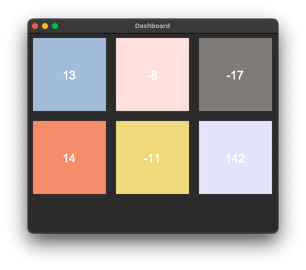

# multithreading-ucs654
**Task:** Create a dashboard that display random numbers with different refresh rates.

<u>[Link to assignment](https://github.com/psrana/Multi-Threading-Using-Python)</u>

***Dashboard created using tkinter:***

